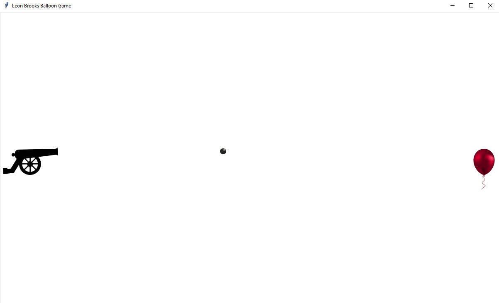

# Balloon-Shooter

A very small game coded for a job interview. I was given the following specifications to build it from scratch in Python.
> Game Description:
>A game with the goal of shooting down a balloon. The player should be able to move a cannon up and down using the arrow keys and shoot using the space bar.
>
>Further Specs:
> - The Balloon should move up and down randomly.
> - The game ends when the balloon is shot down and the number of missed shots should be displayed.
> - The bullet speed should be 10 times the speed of the balloon.
> - The game should run from a single .py file.

As this was my first time developing anything with a GUI in Python, I had to do some research and choose an appropriate python package. Since the game was very simplistic and it had to be delivered in a single file, I settled on [Tkinter][TK]. As a Python standard library, it seemed the best choice for a single file game and appeared to be easy to use. However, down the line this led to some weird speed up/slow down effects as Tkinter's main loop apparently does not always run a constant speeds and function calls appear to affect this somehow. Creating the game overall took be somewhere between 10-20 h, most of it spent working through the spread out Tkinter documentation/tutorials.

## Controls
<table>
<tr><th> Key </th><th> Action </th></tr>
<tr><td> arrow keys </td><td> move cannon </td></tr>
<tr><td> space </td><td> shoot </td></tr>
<tr><td> p </td><td> toggle pause </td></tr>
</table>

[TK]: <https://docs.python.org/3/library/tkinter.html>
